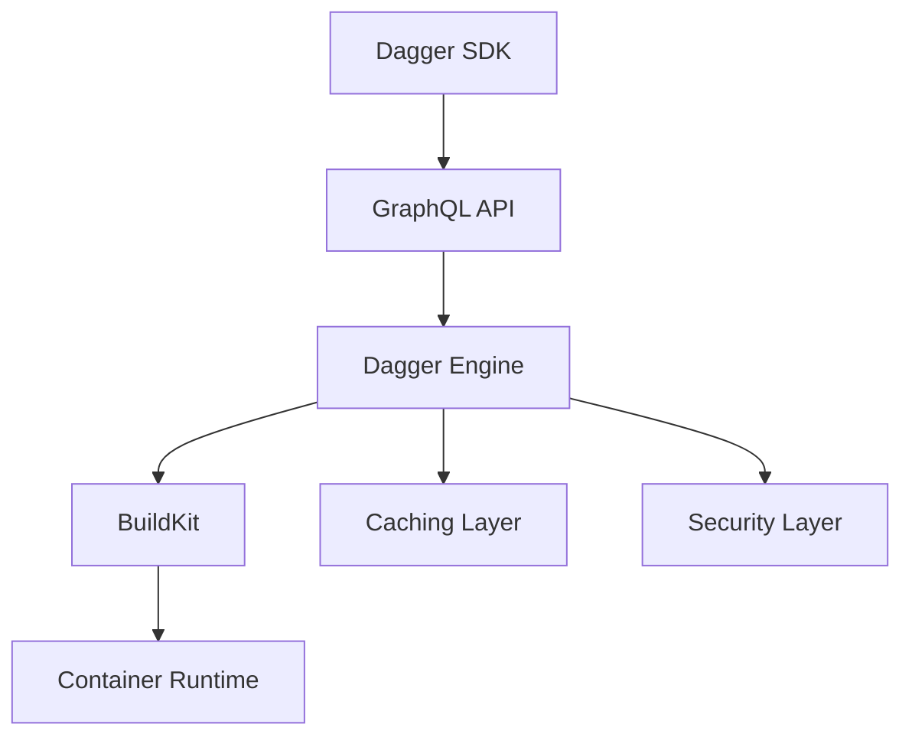
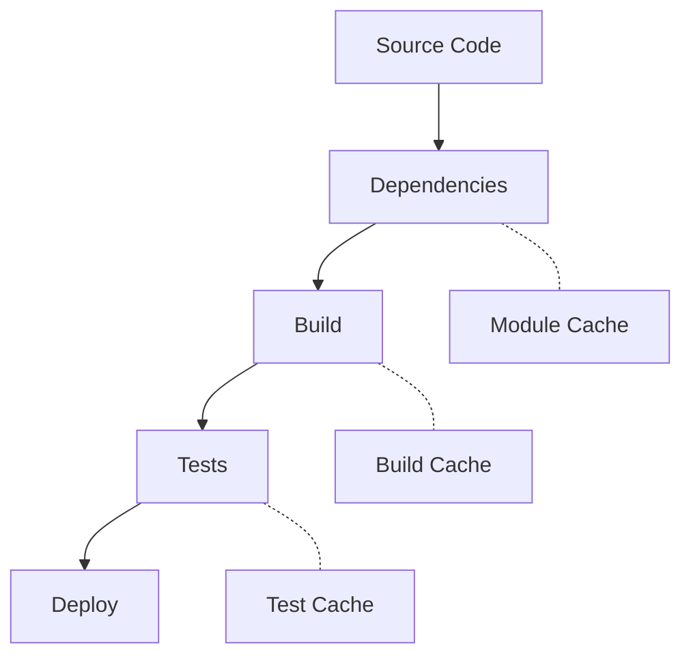

# Building Efficient CI/CD Pipelines with Dagger

Modern Pipeline Development for the Cloud Native Era

<div class="pt-12">
  <span @click="$slidev.nav.next" class="px-2 py-1 rounded cursor-pointer" hover="bg-white bg-opacity-10">
    Press Space for next page <carbon:arrow-right class="inline"/>
  </span>
</div>

<div class="abs-br m-6 flex gap-2">
  <a href="https://github.com/dagger/dagger" target="_blank" alt="GitHub"
    class="text-xl icon-btn opacity-50 !border-none !hover:text-white">
    <carbon-logo-github />
  </a>
</div>

---

# Evolution of CI/CD Pipelines

<div class="grid grid-cols-2 gap-4 mt-4">

<div>

### Traditional Approach (Pre-2024)

- YAML-based configurations
- Limited programming capabilities
- Platform-specific implementations
- Complex dependency management
- Difficult to test locally
- Poor developer experience

</div>

<div>

### Dagger's Innovation (2025)

- Full programming language support
- Universal pipeline portability
- Local-first development
- GraphQL-powered API
- Container-native architecture
- Intelligent caching system

</div>

</div>

<div class="mt-8 text-sm opacity-85">
💡 Dagger brings software engineering practices to CI/CD development
</div>

---

# Core Architecture

<div class="grid grid-cols-2 gap-8">

<div>

### Engine Components



</div>

<div class="mt-4">

### Key Benefits

- **Unified API** - Single interface across platforms
- **Smart Caching** - Intelligent layer and artifact caching
- **Security First** - Built-in secrets management & RBAC
- **Language Native** - Use your preferred programming language
- **Local Development** - Test pipelines before pushing
- **Cloud Native** - Built for modern infrastructure

</div>

</div>

---

# Getting Started

<div class="grid grid-cols-2 gap-4">

<div>

### Quick Setup

```bash
# Initialize Dagger in your project
npm install @dagger.io/dagger
# or
go get dagger.io/dagger
# or
pip install dagger-io
```

### Project Structure

```
myproject/
├── dagger/
│   ├── pipeline.ts
│   └── actions/
├── src/
└── package.json
```

</div>

<div>

### First Pipeline

```typescript
import { connect } from "@dagger.io/dagger";

async function pipeline() {
  const client = connect();

  const result = await client
    .container()
    .from("node:16")
    .withDirectory("/app", client.host().directory("."))
    .withWorkdir("/app")
    .withExec(["npm", "test"])
    .sync();

  console.log("Tests completed:", result);
}
```

</div>

</div>

---

# Advanced Pipeline Patterns

<div class="grid grid-cols-2 gap-4">

<div>

### Matrix Testing

```typescript
const nodeVersions = ["14", "16", "18", "20"];
const platforms = ["linux/amd64", "linux/arm64"];

const tests = await Promise.all(
  nodeVersions.flatMap((version) =>
    platforms.map((platform) =>
      pipeline
        .container()
        .from(`node:${version}`)
        .withPlatform(platform)
        .withExec(["npm", "test"])
    )
  )
);
```

</div>

<div>

### Modular Actions

```typescript
// Reusable test action
export function runTests(
  source: Directory,
  options: TestOptions
): Promise<TestResult> {
  return pipeline
    .container()
    .from(`node:${options.nodeVersion}`)
    .withDirectory("/src", source)
    .withCache("/src/node_modules")
    .withExec(["npm", "ci"])
    .withExec(["npm", "test"]);
}
```

</div>

</div>

---

# Optimizing Performance

<div class="grid grid-cols-2 gap-4">

<div>

### Multi-Stage Builds

```typescript
// Development dependencies
const devStage = pipeline
  .withCache("/app/node_modules")
  .withExec(["npm", "ci"]);

// Production build
const buildStage = devStage
  .withExec(["npm", "run", "build"])
  .withExec(["npm", "prune", "--production"]);

// Deployment image
const deployStage = pipeline
  .from("node:16-alpine")
  .withDirectory("/app/dist", buildStage);
```

</div>

<div>

### Caching Strategies



- Layer-aware caching
- Dependency caching
- Build artifact caching
- Test results caching

</div>

</div>

---

# Security & Compliance

<div class="grid grid-cols-2 gap-4">

<div>

### Security Features

- Secrets management
- RBAC integration
- Image scanning
- Policy enforcement
- Audit logging
- SLSA compliance
- SBOM generation

</div>

<div>

### Implementation

```typescript
const pipeline = new Pipeline()
  // Secrets management
  .withSecret("NPM_TOKEN", client.setSecret("npm-token"))

  // Image scanning
  .withExec([
    "trivy",
    "fs",
    "--severity",
    "HIGH,CRITICAL",
    "--ignore-unfixed",
    ".",
  ])

  // SBOM generation
  .withExec(["syft", "-o", "spdx-json", "--file", "sbom.json", "."]);
```

</div>

</div>

---

# Ecosystem Integration

<div class="grid grid-cols-3 gap-4">

<div>

### CI Platforms

- GitHub Actions
- GitLab CI
- CircleCI
- Jenkins
- Azure Pipelines
- Drone CI
- Tekton

</div>

<div>

### Cloud Services

- AWS (ECS/EKS)
- Google Cloud Run
- Azure Container Apps
- DigitalOcean Apps
- Cloudflare Workers
- Vercel
- Netlify

</div>

<div>

### DevOps Tools

- Docker
- Kubernetes
- Terraform
- Prometheus
- Grafana
- ArgoCD
- Flux

</div>

</div>

<div class="mt-8 text-center text-sm opacity-85">
🔗 Dagger integrates seamlessly with your existing toolchain
</div>

---

# Best Practices & Patterns

<div class="grid grid-cols-2 gap-4">

<div>

### Pipeline Organization

- Modular action design
- Environment abstraction
- Error handling
- Logging & monitoring
- Testing strategies
- Code reusability

</div>

<div>

### Common Patterns

```typescript
// Reusable environment configuration
const withEnvironment = (pipeline: Pipeline, env: string) =>
  pipeline
    .withEnvVariable("NODE_ENV", env)
    .withEnvVariable("LOG_LEVEL", env === "prod" ? "info" : "debug")
    .withSecret("API_KEY", client.setSecret(`${env}-api-key`));

// Usage
const prodPipeline = withEnvironment(pipeline, "prod");
const stagingPipeline = withEnvironment(pipeline, "staging");
```

</div>

</div>

---

# Debugging & Troubleshooting

<div class="grid grid-cols-2 gap-4">

<div>

### Common Issues

- Cache invalidation
- Container compatibility
- Resource constraints
- Network connectivity
- Permission issues
- Platform differences

### Solutions

- Interactive debugging
- Verbose logging
- Cache inspection
- Local reproduction
- Platform simulation

</div>

<div>

### Debug Tools

```bash
# Enable debug logging
export DAGGER_LOG_LEVEL=debug

# Inspect cache
dagger query cache list

# Interactive debug session
dagger debug

# Export pipeline graph
dagger graph export pipeline.dot

# Validate configuration
dagger validate
```

</div>

</div>

---

# Migration Strategies

<div class="grid grid-cols-2 gap-4">

<div>

### Step-by-Step Approach

1. Identify current pain points
2. Map existing workflows
3. Create parallel pipelines
4. Validate & compare results
5. Gradual migration
6. Team training
7. Full cutover

</div>

<div>

### Migration Example

```typescript
// Hybrid approach during migration
async function hybridPipeline() {
  // Run existing CI
  if (process.env.USE_LEGACY) {
    return legacyPipeline();
  }

  // New Dagger pipeline
  const client = connect();
  return client.container().from("node:16").withExec(["npm", "test"]).sync();
}
```

</div>

</div>

---

layout: center
class: text-center

# Thank You!

<div class="flex justify-center">
  
</div>

### Resources

<div class="grid grid-cols-2 gap-4 mt-4 text-left">

<div>

- [Dagger Documentation](https://docs.dagger.io)
- [GitHub Repository](https://github.com/dagger/dagger)
- [Community Discord](https://discord.gg/dagger)
- [Example Projects](https://github.com/dagger/examples)

</div>

<div>

- [API Reference](https://docs.dagger.io/api)
- [Blog Posts](https://dagger.io/blog)
- [Roadmap](https://github.com/dagger/dagger/projects)
- [Contributing Guide](https://docs.dagger.io/contributing)

</div>

</div>

<div class="pt-4">
  <span class="px-2 py-1">
    Questions? Let's discuss! 
  </span>
</div>
